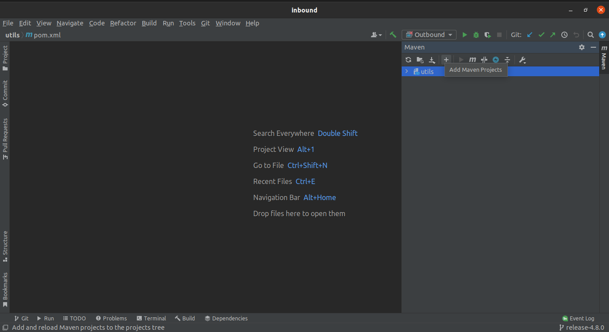
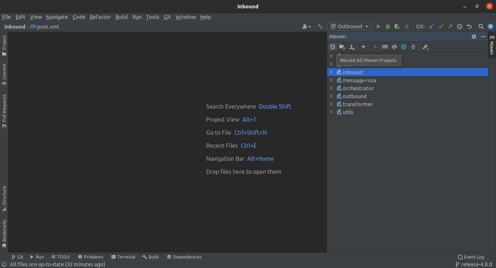
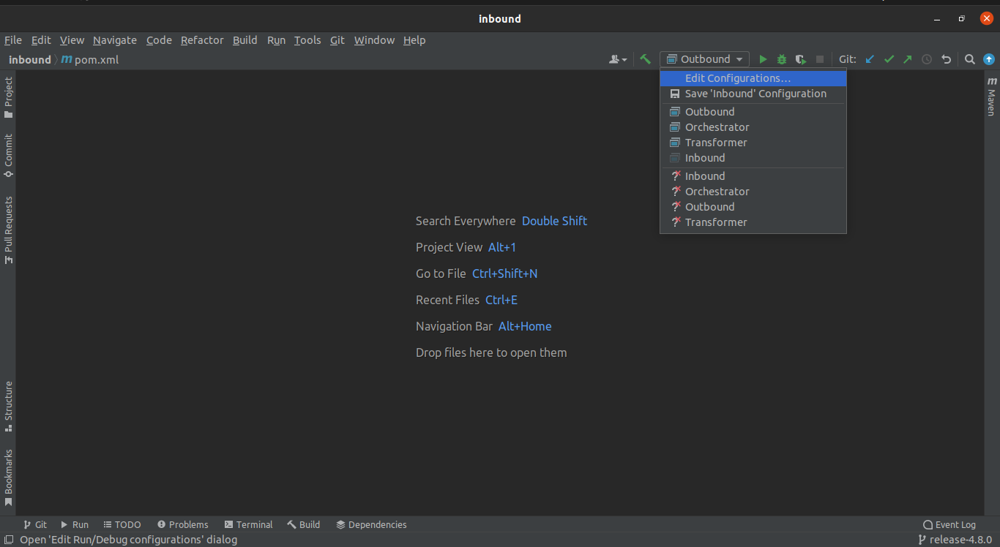
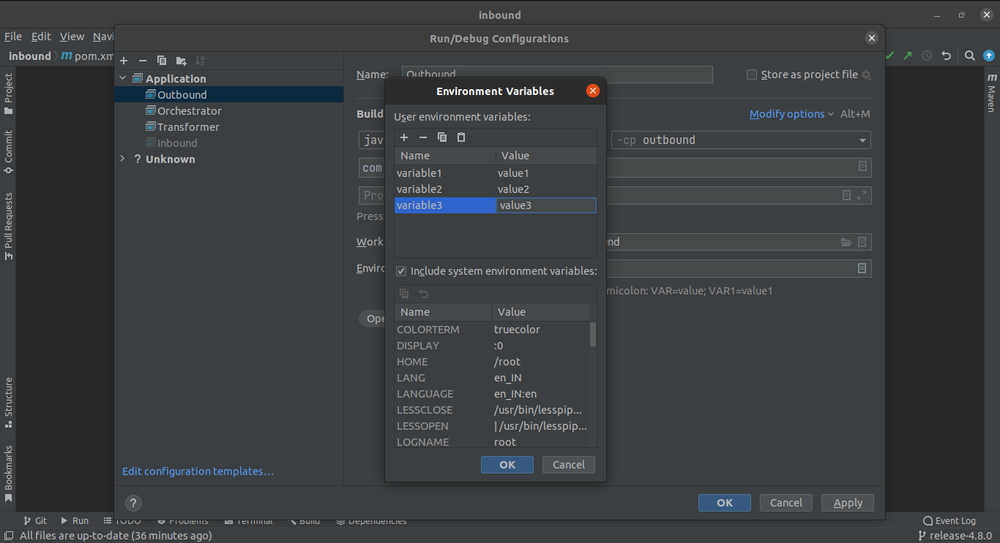

# Setting up IDE
## 1. Overview 
In this doc we'll configure an IDE (Eclipse/IntelliJ) for setting up development enviorment for UCI.

## 2. Setting up IntelliJ

### 2.1 Importing Projects :

* <b>Import new project :</b>  
    ```
    File -> New -> Project from existing source  
    ```
    Then open project as <b>maven project</b> in IntelliJ.

* For importing multiple projects in intelliJ click on <b>maven</b> (in right toolbar) and click on <b>+</b> for opening multiple projects.  


* After importing all the projects in your IntelliJ, now reload all maven project for first time setup.


### 2.2 setting configurations

For setting configuration for any project follow below steps :

* Goto edit configuration. 


* Add new configuration of type Application.


* Now give name to config, select module, select JRE, give path of main class of that module, select working directory as shown in picture. 


* For handling enviorment variables, click on edit enviorment variables (if this colum not shown by default, enable it from <b>modify-options</b>).


* Make these configuration for following projects :  
inbound  
orchestrator  
transformer  
outbound  

### 2.3 Build and Run :

now we can build and Run the projects using below steps :

* Required Plugins to build the project :  
    maven  
    docker  
    lombok 

* Now simply select configuration and click on Run(Shift+F10), to run the project. 

## 3. Setting up Eclipse 

### 3.1 Importing Projects :

* <b>Import Projects into Eclipse :</b>
```
File 
    -> Import 
        -> Projects From Git 
            -> Existing Local Repository 
                -> Select You project
                    -> Finish
```
Import all the project like this.

* After Importing, Update all project for first time setup.
```
Project
    -> Update Maven Project
        -> Select All Projects
            -> Update
```  


### 3.2 setting configurations

For setting configuration for any project follow below steps :

* Make new Configuration for spring-boot-app
```
Run
    -> Run Configurations
        -> Spring Boot App
```

* Now give name to config, select project, select main class of project and click Apply.  


* Now for handling Enviorment Variables click on Enviorment in config window.  
Here we can put enviorment variable's value.


* Make these configuration for following projects :  
inbound  
orchestrator  
transformer  
outbound

### 3.3 Build and Run :

To build and Run in Eclipse, Simply Run the project as Spring Boot App.
```
Run
    -> Run As
        -> Spring Boot App
```