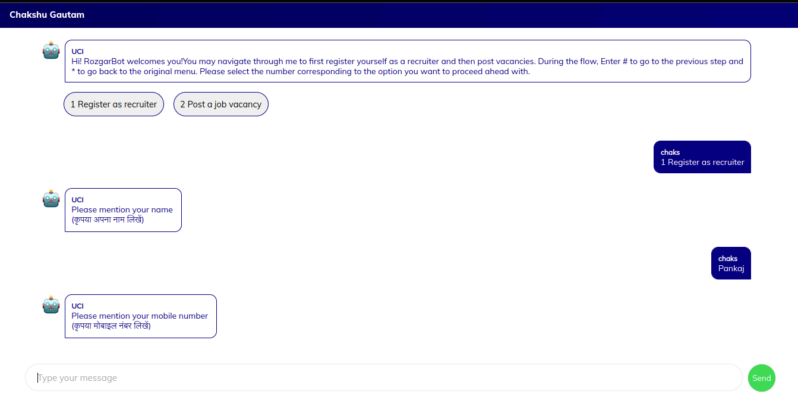

# Setting up your very first conversation

## 1. **Setting up your first bot**

### 1.1. UCI Admin

* Go to admin console. You can find the repo [here](https://github.com/samagra-comms/uci-admin).
* Click on the "Add new button".
* Fill the form with a unique starting message, start date equals to current & end date more than the current date.
* Click on the Next button.
* Click on Add logic button.
* Fill the form & upload a xml form.
* Add this & submit this form.
* The bot will be added and we can start using this on the UCI front.

### 1.2. APIs

#### 1.2.1 Upload ODK Form

*   Convert a ODK Excel form to XML form using [Link](https://getodk.org/xlsform/).

    [Sample ODK Excel Form](https://github.com/samagra-comms/docker-deploy/blob/main/media/List-QRB-Test-Bot.xlsx)
*   Upload this XML from using this api.

    ```
    curl --location 'http://localhost:9999/admin/form/upload' \
    --header 'admin-token: {ADMIN_TOKEN}' \
    --form 'form=@"{PATH_TO_YOUR_XML}"' \
    --form 'mediaFiles=@"{PATH_TO_YOUR_MEDIA_1}"' \
    --form 'mediaFiles=@"{PATH_TO_YOUR_MEDIA_2}"' \
    --form 'mediaFiles=@"{PATH_TO_YOUR_MEDIA_N}"'
    ```

    [Sample ODK XML Form](https://github.com/samagra-comms/docker-deploy/blob/main/List-QRB-Test-Bot.xml)

    **Response**: The API will return a form id. Use this form id to create conversation logic API. Form id E.g. **testing_form**

    ```
    {
        "apiId": "api.form.upload",
        "path": "/admin/form/upload",
        "msgid": "fec3421b-cc04-42e2-9ce9-e004b3ded827",
        "result": {
            "status": "UPLOADED",
            "data": {
                "formID": "testing_form"
            }
        },
        "startTime": "2023-07-04T12:01:00.268Z",
        "method": "POST",
        "endTime": "2023-07-04T12:01:21.785Z"
    }
    ```

#### 1.2.2 Create a Conversation Logic

```
curl --location 'http://localhost:9999/admin/conversationLogic' \
--header 'admin-token: {ADMIN_TOKEN}' \
--header 'Content-Type: application/json' \
--header 'Cookie: fusionauth.locale=en_US; fusionauth.sso=AgOat0GjncGOHhPpH_HuL9QQqnfMitd15O-ofS-uTcdA' \
--data '{
    "data": {
        "id": null,
        "name": "UCI List & Button Logic",
        "description": "UCI List & Button Logic Desc",
        "transformers": [
            {
                "id": "bbf56981-b8c9-40e9-8067-468c2c753659",
                "meta": {
                    "form": "https://hosted.my.form.here.com",
                    "formID": "List-Button-test-v1"
                }
            }
        ],
        "adapter": "44a9df72-3d7a-4ece-94c5-98cf26307323"
    }
}'
```

**Response**: It will return a conversation logic id, use it in create bot. Eg. **92f7b965-4118-4ddc-9c7d-0bc0f77092db**

```
{
    "ts": "2022-05-24T13:48:06.407Z",
    "params": {
        "resmsgid": "23b94970-db68-11ec-ae84-fbd67a9c1174",
        "msgid": null,
        "status": "successful",
        "err": null,
        "errmsg": null
    },
    "responseCode": "OK",
    "result": {
        "data": {
            "transformers": "[{"id":"bbf56981-b8c9-40e9-8067-468c2c753659","meta":{"form":"https://hosted.my.form.here.com/%22,/%22formID/%22:/%22List-Button-test-v1/%22%7D%7D}}]",
            "adapter": "44a9df72-3d7a-4ece-94c5-98cf26307323",
            "name": "UCI demo bot logic",
            "id": "92f7b965-4118-4ddc-9c7d-0bc0f77092db"
        }
    }
}
```

#### 1.2.3 Create a bot

```
curl --location 'http://http//localhost:3002/admin/bot' \
--header 'asset: bot' \
--header 'admin-token: dR67yAkMAqW5P9xk6DDJnfn6KbD4EJFVpmPEjuZMq44jJGcj65' \
--header 'Accept: application/json, text/plain, */*' \
--header 'ownerOrgID: org01' \
--header 'ownerID: 8f7ee860-0163-4229-9d2a-01cef53145ba' \
--form 'botImage=@"{PATH_TO_IMAGE}"' \
--form 'data="{
    \"data\": {
    \"name\": \"TEST ODK BOT\",
    \"description\": \"TEST\",
    \"purpose\": \"TEST\",
    \"startingMessage\": \"Hi Test ODK\",
    \"startDate\": \"2023-06-16\",
    \"endDate\": \"2023-06-30\",
    \"isBroadcastBotEnabled\": true,
    \"segmentId\": \"1\",
    \"status\": \"enabled\",
    \"users\": [],
    \"logic\": [
      \"92f7b965-4118-4ddc-9c7d-0bc0f77092db\" // Get this id from conversation logic api response
    ]
  }
}"'
```

**Response**: This api will return a bot id & other bot information. Use the starting message (Eg. **Hi Test ODK**) from here to start conversation with a bot.

```
{
    "apiId": "api.admin.bot",
    "path": "/admin/bot",
    "apiVersion": "v1",
    "msgid": "ba858dbb-8710-40e3-9fca-e8f928ff2cfc",
    "result": {
        "id": "5066c217-6ae0-4e3c-9802-8c0cce660c2b",
        "createdAt": "2023-07-04T12:59:48.804Z",
        "updatedAt": "2023-07-04T12:59:48.804Z",
        "name": "TEST ODK BOT",
        "startingMessage": "Hi Test ODK",
        "ownerID": null,
        "ownerOrgID": null,
        "purpose": null,
        "description": null,
        "startDate": "2023-06-15T00:00:00.000Z",
        "endDate": "2025-12-01T00:00:00.000Z",
        "status": "ENABLED",
        "tags": [],
        "botImage": "1c8516c6-c4c3-4a37-a8dd-89109e8e0e60.png"
    },
    "startTime": "2023-07-04T12:59:48.265Z",
    "method": "POST",
    "endTime": "2023-07-04T12:59:49.097Z"
}
```

**Note**: If you want to use the gupshup adapter, please contact the [administrator](https://github.com/samagra-comms/docker-deploy#contact-administrator) for credentials.

## **2. Start Using Bots**

### Using Web Channel

Once the bot is created, we can start using it. Send the starting message added in the [**Create a bot**](setting-up-your-very-first-conversation.md#1.2.3-create-a-bot) api.

**Example :** Hi Test Bot



### Using Whatsapp

Once the bot is created, we can start using it. If you have set up gupshup/netcore provider for whatsapp, Send the starting message added in the [**Create a bot**](setting-up-your-very-first-conversation.md#1.2.3-create-a-bot) api to the whatsapp number.


