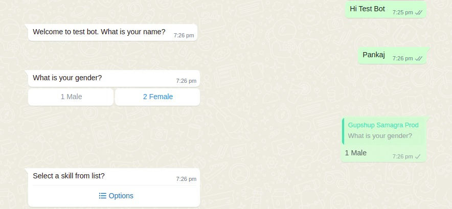

# Setting up your very first conversation

**Setting up your first bot**

1. UCI Admin
   * Go to [Link](http://localhost:9097/uci-admin)
   * Click on the "Add new button".
   * Fill the form with a unique starting message, start date equals to current & end date more than the current date.
   * Click on the Next button.
   * Click on Add logic button.
   * Fill the form & upload a xml form. Eg. [Sample ODK Excel Form](https://github.com/samagra-comms/docker-deploy/blob/main/media/List-QRB-Test-Bot.xlsx)
   * Add this & submit this form.
   * The bot will be added and we can start using this on the [UCI front](http://localhost:9098/).
2.  APIs

    *   Convert a ODK Excel form to XML form using [Link](https://getodk.org/xlsform/).

        [Sample ODK Excel Form](https://github.com/samagra-comms/docker-deploy/blob/main/media/List-QRB-Test-Bot.xlsx)
    *   Upload this XML from using this api.

        ```
        curl --location --request POST 'http://localhost:9999/admin/v1/forms/upload' \
        --header 'admin-token: EXnYOvDx4KFqcQkdXqI38MHgFvnJcxMS' \
        --form 'form=@"{PATH_OF_ODK_FORM}"'
        ```

        [Sample ODK XML Form](https://github.com/samagra-comms/docker-deploy/blob/main/List-QRB-Test-Bot.xml)

        **Response**: The API will return a form id. Use this form id to create conversation logic API. Form id E.g. **List-Button-test-v1**

        ```
        {
            "ts": "2022-05-24T13:46:06.640Z",
            "params": {
                "resmsgid": "dc586de0-db67-11ec-ae84-fbd67a9c1174",
                "msgid": null,
                "status": "successful",
                "err": null,
                "errmsg": null
            },
            "responseCode": "OK",
            "result": {
                "data": "List-Button-test-v1"
            }
        }    
        ```
    *   Create a Conversation Logic

        ```
        curl --location --request POST 'http://localhost:9999/admin/v1/conversationLogic/create' \
        --header 'admin-token: EXnYOvDx4KFqcQkdXqI38MHgFvnJcxMS' \
        --header 'Content-Type: application/json' \
        --data-raw '{
            "data": {
                "name": "UCI demo bot logic",
                "transformers": [
                    {
                        "id": "bbf56981-b8c9-40e9-8067-468c2c753659",
                        "meta": {
                            "form": "https://hosted.my.form.here.com",
                            "formID": "List-Button-test-v1"
                        }
                    }
                ],
                "adapter": "44a9df72-3d7a-4ece-94c5-98cf26307323"
            }
        }'
        ```

        **Response**: It will return a conversation logic id, use it in create bot api. Eg. **92f7b965-4118-4ddc-9c7d-0bc0f77092db**

        ```
        {
            "ts": "2022-05-24T13:48:06.407Z",
            "params": {
                "resmsgid": "23b94970-db68-11ec-ae84-fbd67a9c1174",
                "msgid": null,
                "status": "successful",
                "err": null,
                "errmsg": null
            },
            "responseCode": "OK",
            "result": {
                "data": {
                    "transformers": "[{"id":"bbf56981-b8c9-40e9-8067-468c2c753659","meta":{"form":"https://hosted.my.form.here.com/%22,/%22formID/%22:/%22List-Button-test-v1/%22%7D%7D]",
                    "adapter": "44a9df72-3d7a-4ece-94c5-98cf26307323",
                    "name": "UCI demo bot logic",
                    "id": "92f7b965-4118-4ddc-9c7d-0bc0f77092db"
                }
            }
        }
        ```
    *   Create a bot

        ```
        curl --location --request POST 'http://localhost:9999/admin/v1/bot/create' \
        --header 'admin-token: EXnYOvDx4KFqcQkdXqI38MHgFvnJcxMS' \
        --header 'Content-Type: application/json' \
        --data-raw '{
            "data": {
                "startingMessage": "Hi Test Bot",
                "name": "Test Bot",
                "users": [],
                "logic": [
                    "c556dfc8-5dd3-477c-83bb-65d234c4d223" // Get this id from Create a conversation logic api.
                ],
                "status": "enabled",
                "startDate": "2022-05-24",
                "endDate": "2023-05-24"
            }
        }'
        ```

        **Response**: This api will return a bot id & other bot information. Use the starting message (Eg. **Hi Test Bot**) from here to start conversation with a bot.

        ```
        {
            "ts": "2022-05-24T13:49:15.292Z",
            "params": {
                "resmsgid": "4cc874d0-db68-11ec-ae84-fbd67a9c1174",
                "msgid": null,
                "status": "successful",
                "err": null,
                "errmsg": null
            },
            "responseCode": "OK",
            "result": {
                "data": {
                    "startingMessage": "Hi Test Bot",
                    "name": "Test Bot",
                    "users": [],
                    "status": "enabled",
                    "startDate": "2022-05-24",
                    "endDate": "2023-05-24",
                    "logicIDs": [
                        "92f7b965-4118-4ddc-9c7d-0bc0f77092db"
                    ],
                    "id": "9f0b1401-44d2-46be-83bd-7cbd5014f899"
                }
            }
        }
        ```

    **Note**: If you want to use the gupshup adapter, please contact the [administrator](https://github.com/samagra-comms/docker-deploy#contact-administrator) for credentials.

**Start Using Bots**

Once the bot is created, we can start using it. If you have set up Gupshup/Netcore provider for WhatsApp, send the starting message added in the **Create a Bot** API to the WhatsApp number.


