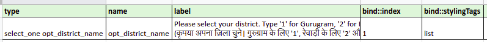
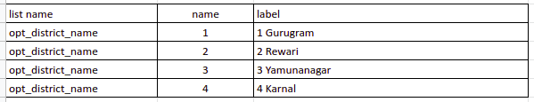
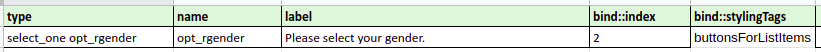
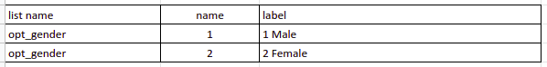

# Interactive Messaging
 
The Interactive Message Templates feature allows you to add buttons in
message templates that can be used with List and Quick Replies. Buttons will give the ability to develop interactive experiences with pre-set options for users.\
There are two types of buttons:
 
## 1. List Message
 
List messages provide a simpler and more consistent format than text-based lists for people to find and select\
List messages are a way to allow users to easily choose from up to 10 options.
 
### 1.1 Steps for creating List Message
 
For sending a List Message, add following properties in ODK form :
 
- **type** : `select_one <field_name>`\
Column _type_ describes the property of any particular message.
 
- **name** : `<field_name>`\
Column _name_ refers to unique _field_name_ of any message.
 
- **label** : `<text>`\
In label, we can write text content that we want to send to user, If there are any choices available for say _slect one field_ the choices will be appended with this text content.
 
- **bind::stylingTags** : `list`\
Bind tag indicates, how a _select choice_ option should be displayed to user as list or buttons. It is also used to define the media type a message.
 
- For creating options as list items we have to add the items in the _choices_ tab as we do for the _select choices_. These are the properties that needs to be set:
 
   - **list name** : `<field_name>`\
   In list name, we write the field name, same as we wrote in the _name_ field of survey tab.
   - **name** : `<indexing>`\
   In name field, we write index of a list item.
   - **label** : `<title>`\
   In label, we can write the title of a list item, which will be shown to the user.
 
### 1.2 Rules for creating List Message
 
- In a single List Message maximum 10 list items are allowed.
- Maximum 24 characters are allowed in list item label.
- Alphanumeric characters and Spaces are allowed in list item label.
 
### 1.3 Example for ODK form of List Message
 
- Survey Tab 

- Choices Tab 

 
### 1.4 Example of List Message Preview
 

 
## 2. Quick Reply Button
 
These quick reply buttons will help improve the quality of conversations with users by prompting responses that can
reduce spelling errors and improve an automated experience.\
These buttons can be attached to text
messages and a maximum of 3 Buttons are allowed in one Message.
 
### 2.1 Steps for creating Quick Reply Button
 
To send Quick Reply Button follow the below steps while creating ODK form :
 
- **type** : `select_one <field_name>`\
Column _type_ describes the property of any particular message.
 
- **name** : `<field_name>`\
Column _name_ refers to unique _field_name_ of any message.
 
- **label** : `<text>`\
In label, we can write text content that we want to send to the user, If there are any choices available for say _slect one field_ the choices will be appended with this text content.
 
- **bind::stylingTags** : `buttonsForListItems`\
Bind tag indicates, how a select choice option should be displayed to user as list or buttons. It is also used to define the media type a message.
 
- For creating buttons for quick reply, we have to add the items in the choices tab as we do for the select choices. These are the properties that needs to be set:
 
   - **list name** : `<field_name>`\
   In list name, we write the field name, same as we wrote in the _name_ field of survey tab.
   - **name** : `<indexing>`\
   In name field, we write index of a list item.
   - **label** : `<title>`\
   In label, we can write the title of a button, which will be shown to the user.
 
### 2.2 Rules for creating Quick Reply Buttons
 
- In a single Quick Reply Message, maximum 3 buttons are allowed.
- Maximum 20 characters are allowed in button label.
- Alphanumeric characters and Spaces are allowed in button label.
 
### 2.3 Example for ODK form of Quick Reply Button
 
- Survey Tab 

- Choices Tab 

 
### 2.4 Example of Quick Reply Button Preview
 

