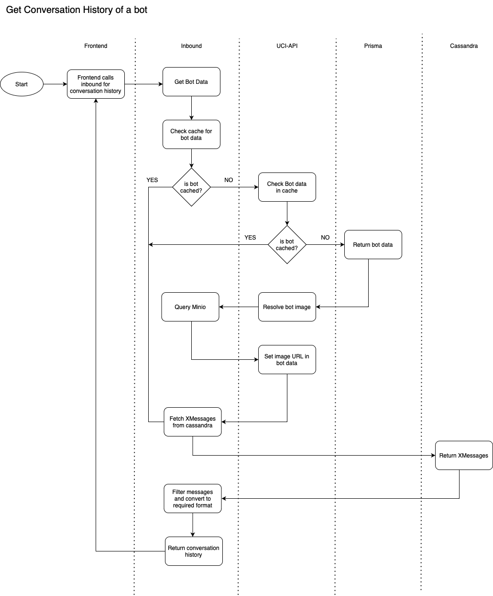

# History APIs

## 1. Overview

UCI provides APIs to fetch the conversation history against a bot or a user.

## **2. APIs**

### **2.1. User History**

Use below API to fetch the history against a bot. **** This API uses below required parameters to fetch the user history.

* **userId**: Phone number of user
* **provider**: Conversation provider. **Eg**. gupshup
* **start & end date**: Conversations between start & end date.

```
curl --location --request GET 'http://INBOUND:PORT/xmsg/history?userId=75********&provider=gupshup&endDate=03-07-2022&startDate=01-07-2022'
```

**Limitation:** This API can provide maximum 1000 conversations.

### **2.2. Bot History**

Use below API to fetch the history against a user. This API uses below required parameters to fetch the user history.

* **botId**: Conversation id
* **provider**: Conversation provider. **Eg**. gupshup
* **start & end date**: Conversations between start & end date.

```
curl --location --request GET 'http://INBOUND:PORT/xmsg/history/dump?provider=gupshup&botId=d655cf03-1f6f-4510-acf6-d3f51b488a5e&endDate=19-07-2022&startDate=05-07-2022'
```

**Limitation:** This API can provide conversations for 15 days only.

### **2.3. Bot + User History**

Use below API to fetch the history against a user for a specific bot. This API uses below required parameters to fetch the history.

* **botId**: Conversation id
* **userId**: Phone number of user
* **provider**: Conversation provider. **Eg**. pwa
* **start & end date**: Conversations between start & end date.

```
curl --location 'http://INBOUND:PORT/xmsg/conversation-history?provider=pwa&endDate=22-06-2023&startDate=15-06-2023&userId=PhoneNo&botId=BOTID'
```

**Limitation:** This API can provide maximum 1000 conversations.

These APIs will give the response in below format.

```
{
    "timestamp": "2022-07-20T09:24:06Z",
    "status": 200,
    "error": null,
    "message": null,
    "path": "/xmsg/history",
    "result": {
        "total": 1,
        "records": [
            {
                "readTimestamp": "2022-08-16T12:37:17.884",
                "messageState": "READ",
                "sentTimestamp": "2022-08-16T12:37:10",
                "channel": "WhatsApp",
                "messageId": "4707198624577024267-422975385292909743",
                "sessionId": "e4f96af4-d714-4d41-bde6-d8cf6280b7d3",
                "ownerId": "b45g6af4-v714-2341-bd89-d8cf6280b76t",
                "fromId": "75********",
                "userId": "admin",
                "provider": "gupshup",
                "botUuid": "09a370f3-712c-4be6-b6aa-6c57957fb670",
                "payload": {
                    "text": "What is your name?"
                },
                "deliveryTimestamp": "2022-08-16T12:37:13.675",
                "ownerOrgId": "ORG_001",
                "id": "2a261c40-1d60-11ed-9003-6d8d3766cc00"
            }
        ]
    }
}
```

### **2.4. Flow Diagram**

Below is the flow diagram of how the history API works.

