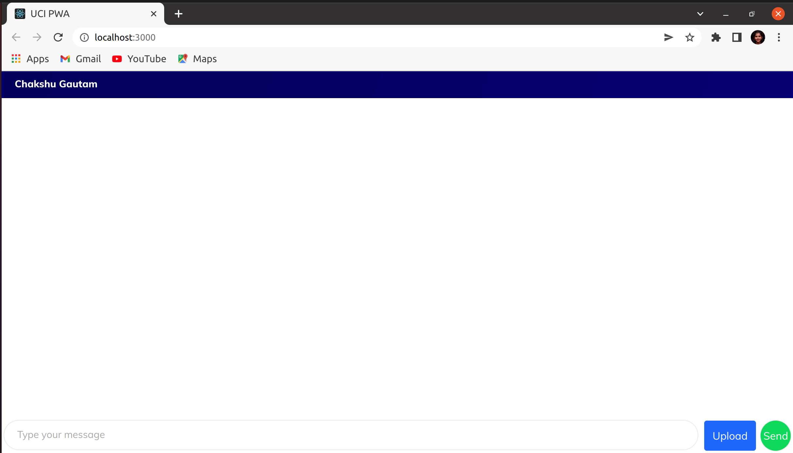
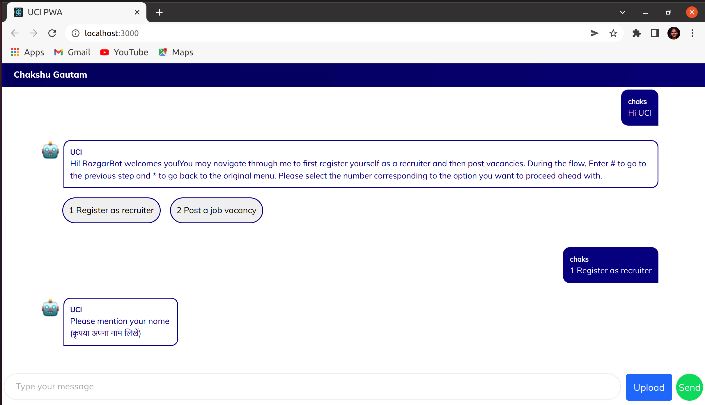

# Frontend Setup (PWA)

## Getting started

### Introduction

The Unified Communications Interface (UCI) aims to democratize the use of different communication channels such as WhatsApp, Telegram, SMS, email and more for governance use cases through a standard configurable manner that is reusable and scalable across all governance use cases.

Transport socket takes request from chatbot client and send it to UCI adapter to get response and return it back to bot client

[UCI] <---> [Socket Transport Layer] <---> [Frontend]

### Overview

This document helps you to setup UCI-PWA which helps you to experience the conversation with chatbot on UCI web channel.

### Pre-requisites

1. Update to latest version

   ```
   $ sudo apt update
   $ sudo apt-get update
   $ sudo apt-get upgrade
   ```

2. Install Git

   ```
   $ sudo apt-get install git
   ```

3. Install curl

   ```
   $ sudo apt-get install curl
   ```

4. Install Node.js, npm, yarn

   ```
   $ sudo apt install nodejs
   $ sudo apt install npm
   $ sudo npm install yarn
   ```

   - Node version should be latest or stable (v16.15.0)
   - To check node version:

     ```
     $ node -v
     ```

5. Install NVM

   ```
   $ curl -o- https://raw.githubusercontent.com/creationix/nvm/v0.39.1/install.sh | bash
   ```

   - Make nvm command available to terminal

   ```
   $ source ~/.nvm/nvm.sh
   ```

   - For more information of node and NVM installation, [check here](https://www.digitalocean.com/community/tutorials/how-to-install-node-js-on-ubuntu-20-04).

6. Switching node version

   - Run the following command to check node version

   ```
   node -v
   ```

   - If your node version is not v16.15.0 or latest, even after installation, you can switch to the required version by the following command:

   ```
   $ nvm install 16.14.0
   $ nvm alias default 16.14.0
   $ nvm use default
   ```

## Setup

### For the first time:

1. **Fork** the repository:

   - To get a copy of the repository, you need to fork the following:-

     - [UCI-PWA](https://github.com/samagra-comms/uci-web-channel)

2. **Clone** the forked repository:

   - To download the forked repository, you need to clone it.

     ```
     $ git clone repository-link
     ```

3. Move to the directory with the cloned repository:

   ```
   $ cd uci-pwa
       or
   $ cd <path of uci-pwa folder>
   ```

4. Run the following command to see if your local copy has a reference to your forked remote repository in GitHub:

   ```
   git remote -v

   # which should give this output-

   origin  https://github.com/Your_Username/repo_name.git (fetch)
   origin  https://github.com/Your_Username/repo_name.git (push)
   ```

5. Import the cloned repository to the chosen IDE.

6. Install the required packages

   - In terminal (location should be same as the current location of the repository), run this command to install all the packages required to run the code:-

   ```
   $ yarn install
   ```

7. Setup all the environment variables:-

   - Make a file named '.env' in the base location of the project directory(where .env-sample is located) and add the following in it.

   - Contact the [administrator](#contact-the-administrator) to get this url or setup this on local using [link](/use/developer/development-environment/transport-socket_pwa.md)

     ```
     REACT_APP_TRANSPORT_SOCKET_URL=ws://url
     ```

   - Contact the [administrator](#contact-the-administrator) to get this or setup this on local using this [link](/use/developer/development-environment/backend-setup.md)

     ```
     REACT_APP_INBOUND_BASE_URL=http://url
     ```

8. Once all the required packages are successfully installed and .env files are setup, start the project.

## Run the project:

1. To start the project, run the following command:-

   ```
   $ yarn start
   ```

2. After running the project, browser displays the following screen:

- This is the first look of UCI-PWA:



- The textbar given below can be used to send messages. Once you send the required starting message, conversation with the bot gets started.



## Contact the administrator

Please write to the Maintainer - Chakshu (chakshu@samagragovernance.in), and cc - Saket (saket@samagragovernance.in), Sukhpreet (sukhpreet@samagragovernance.in)
