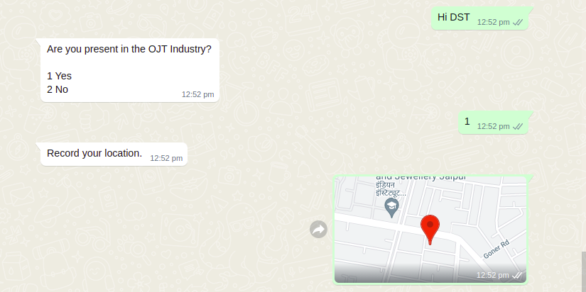

# Location

## Overview

UCI provides an option to receive location from a user. We use question type as geopoint for this.

## Receive **location** from user

**Steps for expecting location**

For receiving media from user, add following properties in ODK form :

* **type** : geopoint\
  Column _type_ describes the property of any particular message.
* **name** : `<field_name>`\
  Column _name_ refers to unique _field\_name_ of any message. &#x20;
* **label** : `<text>`\
  In label, we can write text content that we want to send to user.&#x20;

**ODK location type example**

**Whatsapp Preview**

