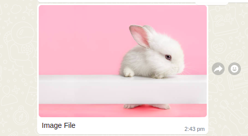

# Media Messages

## Overview

UCI provides an option to send media files to user or receive the media files from user. We use different types of styling tags to send media files to user.

### 1. Send media to user

We use below styling tags to send media files to user.

1. image
2. audio
3. video
4. file (Document files only)

As the name says these tags are used to specify the media type to be sent to user. These styling tags will be added&#x20;

**Steps for adding media message**

For sending a media to user, add following properties in ODK form :

* **type** : `select_one <field_name>`\
  Column _type_ describes the property of any particular message.
* **name** : `<field_name>`\
  Column _name_ refers to unique _field\_name_ of any message. &#x20;
* **label** : `<text>`\
  In label, we can write text content that we want to send to user. For media files mention the file name that you are uploading inside {} placeholders. For example, if your file name is 'test.png', set the label as {test.png}.&#x20;
* **bind::stylingTags** : `image/audio/video/file`\
  This column indicates, which type of media file should be displayed to user.
* **bind::caption** : \<caption>\
  This column has the caption for media file specifically for image/file. As for whatsapp the caption is required.&#x20;

**ODK Styling tag example:**

**Whatsapp Preview**

### 2. Receive media from user

In ODK forms we can specify which type of content we want from the user. For media files, we should mention the type for media ones. Below are the types for media files.

1. image
2. audio
3. video
4. file

**2.1 Steps for expecting media message**

For receiving media from user, add following properties in ODK form :

* **type** : `image/audio/video/file`\
  Column _type_ describes the property of any particular message.
* **name** : `<field_name>`\
  Column _name_ refers to unique _field\_name_ of any message. &#x20;
* **label** : `<text>`\
  In label, we can write text content that we want to send to user.&#x20;

**2.2 Allowed files types**

| Field Type | Allowed Media Type                                                                                           |
| ---------- | ------------------------------------------------------------------------------------------------------------ |
| Image      | image/jpg, image/jpeg, image/gif, image/png                                                                  |
| Audio      | audio/mp3, audio/aac, audio/wav, audio/flac, audio/ogg, audio/ogg; audio/wma, audio/x-ms-wma, audio/mpeg     |
| Video      | video/mp4, video/flc, video/mov, video/wmv, video/mkv, video/quicktime, video/x-matroska, video/x-flv        |
| File       | application/pdf, application/msword, application/vnd.openxmlformats-officedocument.wordprocessingml.document |

**2.3 ODK media type example**

