## About UCI Admin Console

In order to start any conversation, we must first create a bot. These bots are powered by ODK. 
Repo: https://github.com/samagra-comms/uci-admin
The following steps are required to create a bot:-

#### Login To Admin Panel 
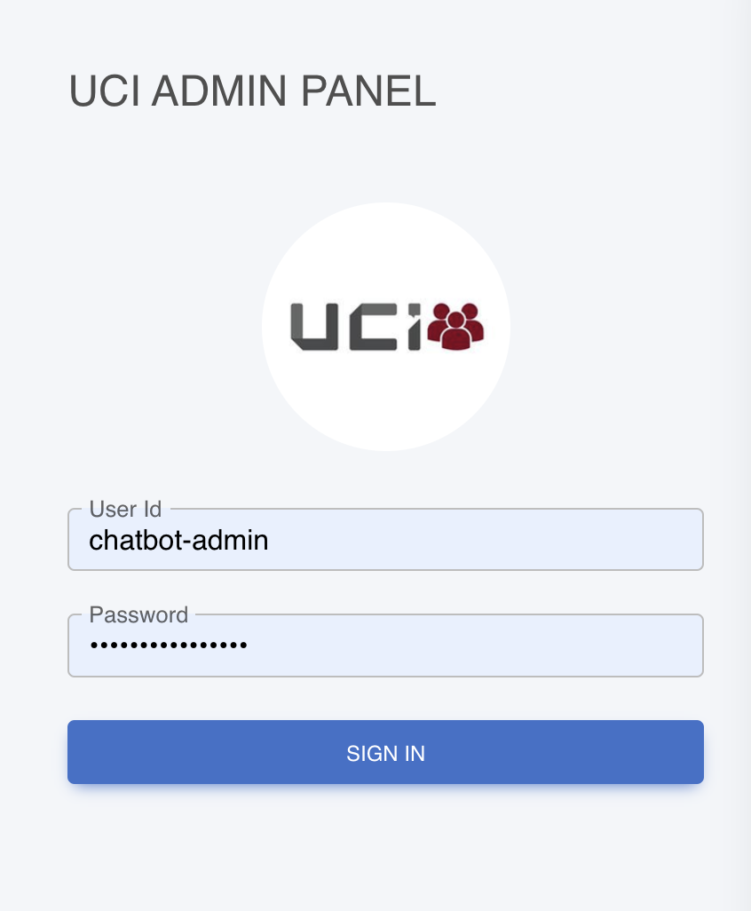

#### Once logged in you will be redirected to the dashboard, where you’ll see all the available bots.
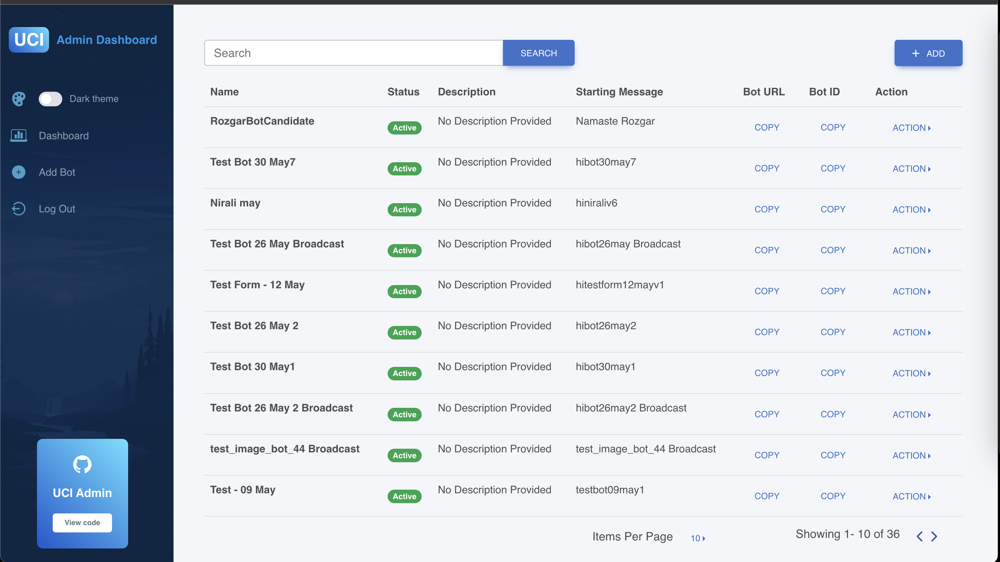

#### Go to the Bot Create Page, by clicking on the add button.
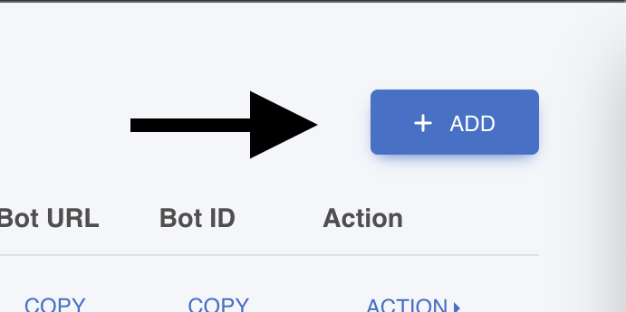

#### Fill in the required fields.
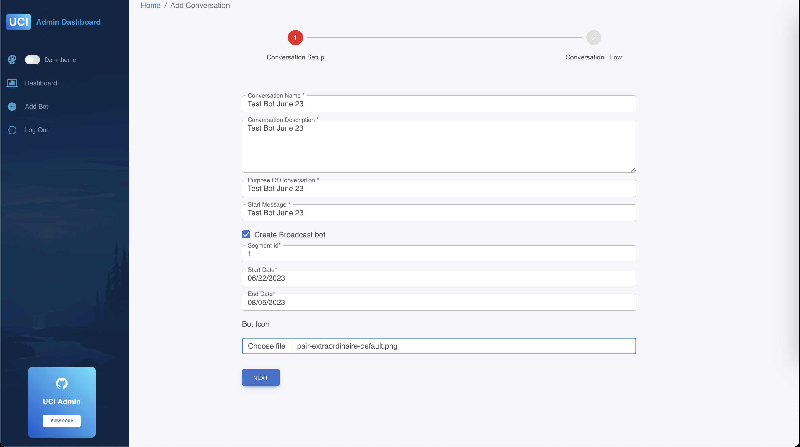
 
  * Here, “Conversation Name” and the “Start Message”  should be unique for each bot.

  * “Create Broadcast bot” checkbox should be checked if you want to create a broadcast bot (Bot to send notifications to all the available users ).
 
  * Provide the segment Id (Unified Communication Interface | Messages)  

  * Provide the bot's Start and End Date.

  * Choose the bot Icon.

  * Once all valid details are provided you can move to the “Add Conversation Logic” Step

#### Add Conversation Logic
  Now, add the conversation logic (provide survey odk)  for the bot by clicking on “Add Logic”.
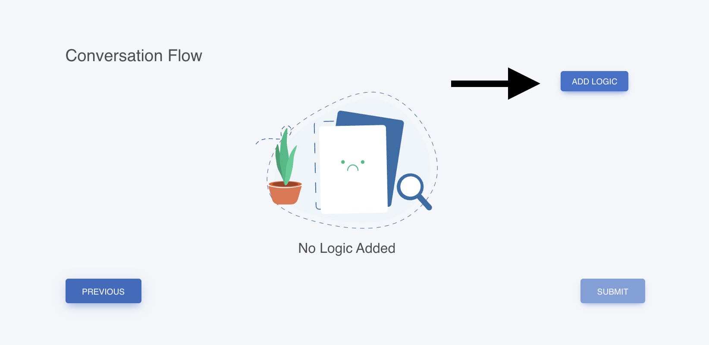

  * Fill in the valid logic details. 
   
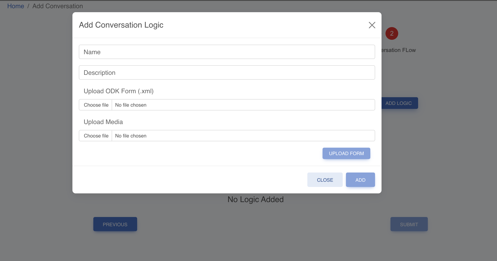

#### Upload the ODK Form And Media (if there are any).

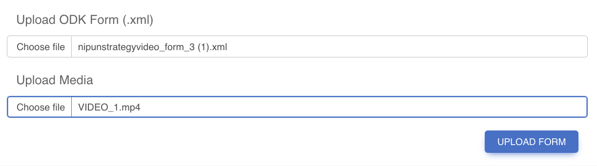

* If you are uploading a form with media,then you have to add the media name inside `{}` in the odk form where you want to have media.
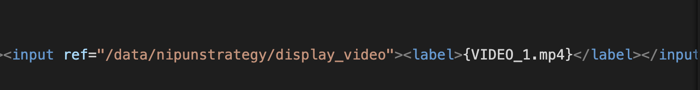


Once an ODK form is uploaded, the same form cannot be used again with the same form version.

 

#### Submit the form.
Once the form and media are successfully uploaded, click on the add button to submit the conversation logic.

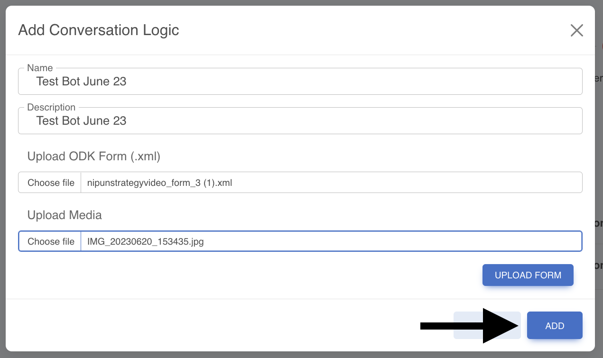
##### [Sample Form](https://docs.google.com/spreadsheets/d/1SoOa4eRqOzNZ7VbiR8eEO0sjeZh7SRe2/edit?usp=sharing&ouid=100707492866343481921&rtpof=true&sd=true)

####  Add/View/Edit your conversation logic

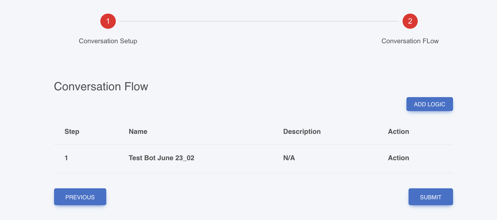

#### Create a Bot,  click on submit button.

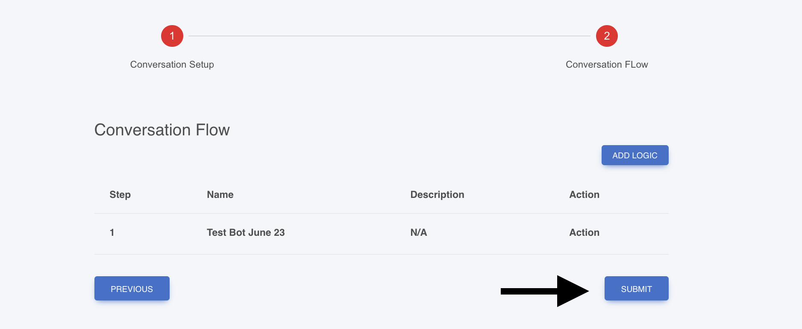

 Once successfully submitted, you’ll get a success screen and you can see your new bot in the dashboard’s bot list.

#### Demo
If you wish to access our staging admin console, kindly visit https://uci-admin-samagra.vercel.app/login. Kindly reachout to us for credentials. 

